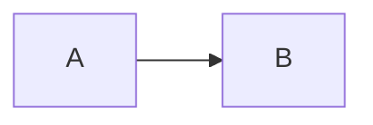

# 常见问题

## 构建与部署

### Q: EdgeOne Pages 构建失败，提示 "Output directory dist does not exist"

A: 检查 `edgeone.json` 中的 `outputDirectory` 是否为 `dist`，且 `npm run build` 确实会生成 `dist/` 目录。

### Q: 部署后样式没有更新

A: 修改 `base.html` 中 CSS/JS 引用版本号：

```html
<link rel="stylesheet" href="assets/css/style.css?v=6">
```

或强制刷新浏览器 `Ctrl+F5`。

### Q: 自定义域名显示 "已生效" 但访问不到

A: 等待 2-5 分钟 DNS 全球生效，或刷新本地 DNS 缓存：

```powershell
ipconfig /flushdns
```

## 文章写作

### Q: 文章中的 `.md` 链接不会自动跳转

A: 确保使用相对路径格式：

```markdown
[相关文章](./another-article.md)
```

构建时会自动转换为 `https://your-domain/posts/another-article/`。

### Q: 代码块为什么没有语法高亮

A: 当前主题已提供代码块样式、行号和复制按钮，但还没有集成 Prism.js、highlight.js 这类语法高亮库。如需高亮，可在 `base.html` 中按需引入。

### Q: 支持流程图或图表吗

A: 支持。使用 `mermaid` 代码块：

````markdown

````

### Q: 文章删除后页面还在

A: 删除 `content/posts/xxx.md` 后重新 `git push`，下次构建会自动清理。

## 主题与样式

### Q: 如何修改字体

A: 在 `base.html` 引入字体 CDN，然后在 `style.css` 中修改 `font-family`。

### Q: 移动端样式错乱

A: 检查 `style.css` 底部的 `@media` 查询，按需调整断点。

### Q: 中文标签的 URL 是什么样的

A: 中文标签保留原样生成 slug，空格和特殊符号转为 `-`。例如标签 `深度学习` 的 URL 为 `/tags/深度学习/`。

## 其他

### Q: 想修改构建逻辑，应该改哪个文件

A: 构建入口为 `build.js`，核心模块在 `lib/` 目录下：

- `lib/content.js` — 内容拉取、Markdown 解析、Frontmatter 处理
- `lib/generators.js` — 各类型页面生成
- `lib/renderer.js` — Nunjucks 模板渲染
- `lib/utils.js` — 编码转换、slug 生成等工具函数

### Q: 账户存储超限 5GB

A: 在 EdgeOne Pages 控制台删除旧部署记录释放空间。

### Q: 支持多少篇文章？

A: 无硬性数量限制，受 5GB 存储和 20,000 文件数限制。纯文本博客通常可支持数千篇。
