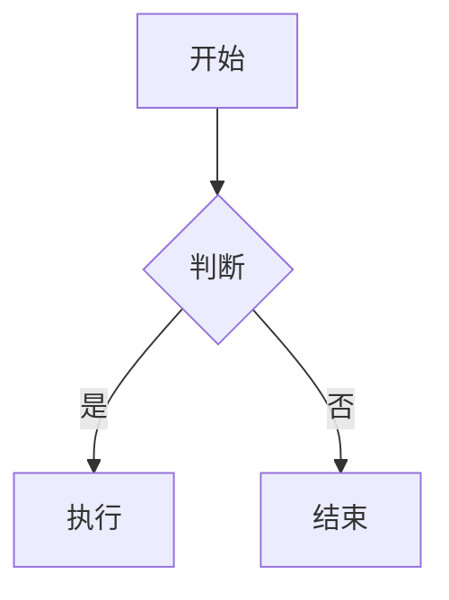

# 写作指南

## 文件位置

所有文章放在 `content/posts/` 目录下，文件名即 URL slug。

```
content/posts/
├── hello-world.md
├── my-article.md
└── 2026-04-08-title.md
```

## Frontmatter

每篇文章开头必须包含 YAML frontmatter：

```markdown
---
title: 文章标题
date: 2026-04-08
tags: [tag1, tag2]
---
```

### 字段说明

| 字段 | 类型 | 必填 | 说明 |
|------|------|------|------|
| `title` | string | ✅ | 文章标题 |
| `date` | string | ❌ | 发布日期，`YYYY-MM-DD` 格式；未填写时默认使用文件修改时间（mtime） |
| `tags` | string[] | ❌ | 标签数组 |
| `draft` | boolean | ❌ | `true` 时不发布 |

### 标签 slug 规则

标签会按以下规则生成 URL slug：

- 转为小写
- 空格、下划线替换为 `-`
- 保留中文字符
- 移除其他特殊符号

例如：`深度学习` → `/tags/深度学习/`，`Node.js` → `/tags/node-js/`。

## Markdown 语法

支持标准 Markdown 及扩展：

```markdown
# 一级标题
## 二级标题

**粗体** *斜体* ~~删除线~~

- 无序列表
- 子项

1. 有序列表
2. 第二项

> 引用块

[链接文本](https://example.com)


| 表格 | 列二 |
|------|------|
| A    | B    |

```代码块
支持围栏代码块、代码样式、行号与复制按钮（当前未集成语法高亮库）
```
```

### Mermaid 图表

支持 `mermaid` 代码块：

````markdown

````

## 内部文章链接

链接到站内其他文章时，直接使用 `.md` 文件路径：

```markdown
[相关文章](./another-article.md)
```

构建时会自动转换为正确的文章 URL。

## 图片引用

### 方式一：外部图床

```markdown

```

### 方式二：仓库内图片

将图片放入 `src/assets/` 下的任意子目录（如 `src/assets/images/`），在 Markdown 中使用绝对路径：

```markdown

```

## 编码与换行

- 文件编码：**UTF-8 无 BOM**
- 换行符：LF（脚本会自动将 CRLF 转为 LF）
- 支持 GBK/GB2312 自动识别转换

## 文章删除

直接删除 `content/posts/` 下的 `.md` 文件，下次构建时对应页面会自动清理。

---

## 发布前审查（推荐流程）

> 文章风格不必模板化，但技术准确性和代码可执行性必须保证。

初版完成后，建议至少跑一遍以下检查：

### 1. 技术事实核查
- 所有技术断言是否有官方文档或实测支持？
- 版本号、参数行为、默认值是否与官方一致？
- 是否存在"过于绝对"的表述（如"本质""完全"）？

### 2. 代码可执行性验证
- 所有 PowerShell/curl/aria2c 命令在 **Windows PowerShell 5.1** 环境下能否直接复制运行？
- 路径含空格时是否加了引号/`&` 运算符？
- 超时、阻塞、编码等边界情况是否处理？
- **建议在虚拟机（如 VirtualBox）中实测一遍**

### 3. 链接与一致性
- **推荐**：站内链接使用 `./another-article.md` 相对路径，构建时会自动转换为 `/posts/xxx/`
- **例外**：跨目录引用或需要精确控制 URL 时，可直接写 `/posts/xxx/`
- 同一篇文章内部保持统一，不要混用两种风格
- 外部 URL 无空格、无截断
- 同一概念在不同文章中表述一致

### 4. 构建验证
```bash
npm run build
```

确保无报错，新文章正确生成 `dist/posts/<slug>/index.html`。

---

> 初版问题不可避免。多在不同环境试几遍、多做验证、多跑审查，文章质量自然就高了。
