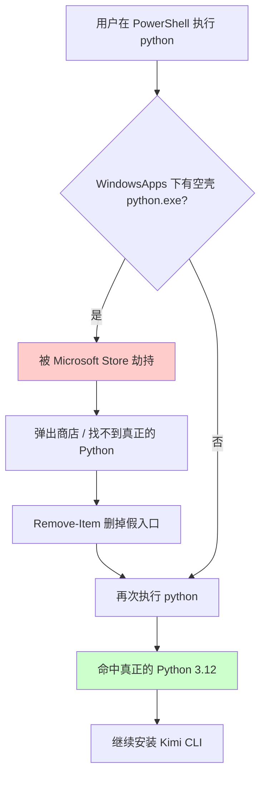

> ⚠️ **官方已迁移**：`kimi-cli` 已品牌迁移为 `kimi-code`，包名与安装方式均有变化。本文所述的 `kimi-cli` 目前仍可正常使用，但不再更新维护。
>
> 如需安装新版 Kimi Code，请参考新文：[还原机房一条龙：PS7 + Git + Node.js + npm + Bun + Kimi Code 极速装机](./win-restore-workflow.md)

## 环境信息

| 项目 | 说明 |
| ------ | ------ |
| **系统** | Windows 10 / Windows 11（64 位） |
| **权限** | 普通用户即可（无需管理员，安装过程 0 弹窗） |
| **目标** | 一行 PowerShell 完成 Python 3.12 + uv + kimi-cli 全套环境 |
| **网络** | 国内环境，使用清华 TUNA / 阿里云镜像加速 |

---

## 完整命令（复制即用）

以普通用户身份打开 PowerShell，复制粘贴执行：

```powershell
[Net.ServicePointManager]::SecurityProtocol=[Net.SecurityProtocolType]::Tls12;Set-ExecutionPolicy Bypass -Scope Process -Force;Remove-Item "$env:LOCALAPPDATA\Microsoft\WindowsApps\python.exe" -ErrorAction SilentlyContinue;Remove-Item "$env:LOCALAPPDATA\Microsoft\WindowsApps\python3.exe" -ErrorAction SilentlyContinue;$pyDir="$env:LOCALAPPDATA\Programs\Python\Python312";$pyExe="$pyDir\python.exe";if(-not(Test-Path $pyExe)){Write-Host ">>> 安装 Python 3.12 (清华 TUNA 镜像)..." -ForegroundColor Cyan;$i="$env:TEMP\py.exe";if(Test-Path $i){Remove-Item $i -Force};Invoke-WebRequest -Uri "https://mirrors.tuna.tsinghua.edu.cn/python/3.12.4/python-3.12.4-amd64.exe" -OutFile $i -UseBasicParsing;Start-Process $i -ArgumentList "/quiet PrependPath=1 Include_test=0 InstallAllUsers=0" -Wait;if(-not(Test-Path $pyExe)){Write-Host ">>> Python 安装失败，可能是安装包损坏。请手动删除 $i 后重试" -ForegroundColor Red;Read-Host "按回车退出";exit 1}};$env:Path="$pyDir;$pyDir\Scripts;$env:Path";Write-Host ">>> 安装 uv (清华源)..." -ForegroundColor Cyan;python -m pip install uv -i https://pypi.tuna.tsinghua.edu.cn/simple/ --user --quiet;[Environment]::SetEnvironmentVariable("UV_INDEX_URL","https://pypi.tuna.tsinghua.edu.cn/simple/","User");[Environment]::SetEnvironmentVariable("UV_EXTRA_INDEX_URL","https://mirrors.aliyun.com/pypi/simple/","User");$env:UV_INDEX_URL="https://pypi.tuna.tsinghua.edu.cn/simple/";$env:UV_EXTRA_INDEX_URL="https://mirrors.aliyun.com/pypi/simple/";Write-Host ">>> 安装 kimi-cli..." -ForegroundColor Cyan;python -m uv tool install kimi-cli --force;$uPath=[Environment]::GetEnvironmentVariable("Path","User");$uvUserBin="$env:APPDATA\Python\Python312\Scripts";$uvToolBin="$env:USERPROFILE\.local\bin";if($uPath -notlike "*$uvUserBin*"){[Environment]::SetEnvironmentVariable("Path","$uPath;$uvUserBin","User")};if($uPath -notlike "*$uvToolBin*"){[Environment]::SetEnvironmentVariable("Path","$uPath;$uvToolBin","User")};$env:Path="$env:Path;$uvUserBin;$uvToolBin";Write-Host ">>> 完成！" -ForegroundColor Green;python --version;python -m uv --version;kimi --version;Write-Host "`n✓ 环境变量已永久保存" -ForegroundColor Green;Read-Host "按回车退出"
```

> **提示**：脚本运行期间请不要关闭窗口，最后会打印版本号表示成功。

---

## 分步详解

### 1. 启用 TLS 1.2 与绕过执行策略

```powershell
[Net.ServicePointManager]::SecurityProtocol=[Net.SecurityProtocolType]::Tls12
Set-ExecutionPolicy Bypass -Scope Process -Force
```

- **TLS 1.2**：Windows 默认可能只启用 TLS 1.0/1.1，下载 Python 安装包时会握手失败，强制启用 1.2 确保能正常下载。
- **执行策略**：PowerShell 默认禁止运行脚本，`Bypass -Scope Process` 仅当前会话放行，不会影响系统安全策略，关闭窗口即失效。

### 2. 清理 Microsoft Store 的假 `python`

```powershell
Remove-Item "$env:LOCALAPPDATA\Microsoft\WindowsApps\python.exe" -ErrorAction SilentlyContinue
Remove-Item "$env:LOCALAPPDATA\Microsoft\WindowsApps\python3.exe" -ErrorAction SilentlyContinue
```

Windows 10/11 会在 `WindowsApps` 目录放一个 **App Execution Alias**（空壳 `python.exe`）。  
即使你的 PATH 里已经有真正的 Python，执行 `python` 时仍可能被它劫持到 Microsoft Store。脚本在安装前先删掉这两个假入口，防止后续命令被截胡。

**进阶说明：Microsoft Store 假 `python` 劫持流程**



### 3. 检测并安装 Python 3.12（清华 TUNA 镜像）

```powershell
$pyDir="$env:LOCALAPPDATA\Programs\Python\Python312"
$pyExe="$pyDir\python.exe"
if(-not(Test-Path $pyExe)){
    Write-Host ">>> 安装 Python 3.12 (清华 TUNA 镜像)..." -ForegroundColor Cyan
    $i="$env:TEMP\py.exe"
    if(Test-Path $i){
        Write-Host ">>> 检测到旧的临时文件，删除后重新下载..." -ForegroundColor Yellow
        Remove-Item $i -Force
    }
    Invoke-WebRequest -Uri "https://mirrors.tuna.tsinghua.edu.cn/python/3.12.4/python-3.12.4-amd64.exe" -OutFile $i -UseBasicParsing
    Start-Process $i -ArgumentList "/quiet PrependPath=1 Include_test=0 InstallAllUsers=0" -Wait
    if(-not(Test-Path $pyExe)){
        Write-Host ">>> Python 安装失败，可能是安装包损坏。请手动删除 $i 后重试。" -ForegroundColor Red
        exit 1
    }
}
```

| 参数 | 含义 |
| ------ | ------ |
| `/quiet` | 静默安装，全程无弹窗 |
| `PrependPath=1` | 自动将 Python 加入用户 PATH |
| `Include_test=0` | 不安装测试套件，节省空间与时间 |
| `InstallAllUsers=0` | 仅安装到当前用户目录，无需管理员权限 |

> **为什么用 `Test-Path` 而不是 `Get-Command python`？**  
> 因为 `Get-Command python` 在 Windows 上可能命中 Microsoft Store 的空壳 `python.exe`，造成"已安装"的误判，导致跳过安装，后续 `python -m pip` 直接报错。

> **为什么用清华 TUNA？**  
> 国内下载 `python.org` 官方安装包极慢，清华 TUNA 镜像同步了完整的 Python 发布目录，且支持直链下载，速度快且稳定。

### 4. 强制刷新当前会话的 PATH

```powershell
$env:Path="$pyDir;$pyDir\Scripts;$env:Path"
```

Python 安装程序修改的是**注册表里的永久 PATH**，但**正在运行的 PowerShell 窗口不会自动感知**。  
如果不把这行加上，后续所有 `python` 命令都会报 `无法将“python”项识别为 cmdlet...`。  
我们通过将真实 Python 目录 prepend 到当前会话的 `$env:Path` 最前面，确保本窗口内立即生效，同时绕过 WindowsApps 的优先级干扰。

### 5. 安装 uv（清华 PyPI 镜像）

```powershell
Write-Host ">>> 安装 uv (清华源)..." -ForegroundColor Cyan
python -m pip install uv -i https://pypi.tuna.tsinghua.edu.cn/simple/ --user --quiet
```

- **uv**：Rust 编写的高性能 Python 包管理器，替代 `pip` + `venv` + `pip-tools`，安装 kimi-cli 及其依赖极快。
- **清华源**：国内访问 PyPI 官方源常超时，清华 TUNA 同步频率高、带宽大。
- **`--user`**：安装到用户目录，避免写入系统 `Program Files` 的权限问题。

### 6. 配置 uv 永久镜像环境变量

```powershell
[Environment]::SetEnvironmentVariable("UV_INDEX_URL","https://pypi.tuna.tsinghua.edu.cn/simple/","User")
[Environment]::SetEnvironmentVariable("UV_EXTRA_INDEX_URL","https://mirrors.aliyun.com/pypi/simple/","User")
$env:UV_INDEX_URL="https://pypi.tuna.tsinghua.edu.cn/simple/"
$env:UV_EXTRA_INDEX_URL="https://mirrors.aliyun.com/pypi/simple/"
```

| 变量 | 作用 |
| ------ | ------ |
| `UV_INDEX_URL` | uv 默认 PyPI 主源 → **清华 TUNA** |
| `UV_EXTRA_INDEX_URL` | uv 备用源 → **阿里云**，主源抽风时自动 fallback |

- **`[Environment]::SetEnvironmentVariable(..., "User")`**：写入注册表，永久生效，以后新开终端无需再配。
- **`$env:XXX=...`**：仅对当前 PowerShell 会话立即生效，保证后续 `uv tool install` 也能走镜像。

### 7. 安装 kimi-cli

```powershell
Write-Host ">>> 安装 kimi-cli..." -ForegroundColor Cyan
python -m uv tool install kimi-cli --force
```

这里使用 `python -m uv` 调用，是为了兼容**刚安装完 uv 但还未刷新环境变量**的窗口。uv 会自动把 `kimi` 装到用户目录下的 `.local\bin` 中。

### 8. 将 uv 与 kimi 加入用户 PATH（永久生效）

```powershell
$uPath=[Environment]::GetEnvironmentVariable("Path","User")
$uvUserBin="$env:APPDATA\Python\Python312\Scripts"
$uvToolBin="$env:USERPROFILE\.local\bin"

# 把 pip --user 安装的 uv.exe 目录加入 PATH
if($uPath -notlike "*$uvUserBin*"){
    [Environment]::SetEnvironmentVariable("Path","$uPath;$uvUserBin","User")
}

# 把 uv tool 安装的工具目录（kimi.exe）加入 PATH
if($uPath -notlike "*$uvToolBin*"){
    [Environment]::SetEnvironmentVariable("Path","$uPath;$uvToolBin","User")
}

# 当前会话立即生效
$env:Path="$env:Path;$uvUserBin;$uvToolBin"
```

**为什么要做这一步？**

- `pip install --user` 会把 `uv.exe` 装到 `%APPDATA%\Python\Python312\Scripts`，这个目录**默认不在系统 PATH 里**。如果不加，以后新开终端输入 `uv` 会报找不到命令。
- `uv tool install` 会把 `kimi.exe` 装到 `%USERPROFILE%\.local\bin`，同样需要手动加入 PATH。

### 9. 验证安装

```powershell
python --version          # Python 3.12.4
python -m uv --version    # uv x.x.x
kimi --version            # kimi-cli x.x.x
```

三条命令都输出版本号，说明全套环境已就绪。  
**关闭当前 PowerShell，重新开一个普通窗口**，输入 `kimi` 即可开始使用。

---

## 装完后，文件都在哪？

| 组件 | 实际路径 | 说明 |
| ------ | ---------- | ------ |
| **Python 3.12** | `C:\Users\<用户名>\AppData\Local\Programs\Python\Python312` | 用户级安装，无管理员也能用 |
| **uv 本体** | `C:\Users\<用户名>\AppData\Roaming\Python\Python312\Scripts\uv.exe` | `pip install --user` 安装的位置 |
| **kimi-cli** | `C:\Users\<用户名>\.local\bin\kimi.exe` | uv 工具链管理的二进制入口 |
| **uv 虚拟环境/缓存** | `C:\Users\<用户名>\AppData\Roaming\uv` | uv 下载的依赖、工具包缓存 |

> 想确认某个命令装到哪了？在 PowerShell 里用 `(Get-Command kimi).Source` 或 `where kimi` 查看。

---

## 常见问题 FAQ

### Q1：安装完新终端里输入 `uv` 提示找不到命令？

**原因**：`uv` 是通过 `pip install --user` 装的，落在了 `%APPDATA%\Python\Python312\Scripts`，这个目录默认不在 PATH 里。  
**解决**：把下面路径加到用户环境变量 `Path` 中：
```
%APPDATA%\Python\Python312\Scripts
```

### Q2：输入 `kimi` 提示找不到命令？

**原因**：`kimi.exe` 在 `%USERPROFILE%\.local\bin`，没加到 PATH。  
**解决**：把下面路径加到用户环境变量 `Path` 中：
```
%USERPROFILE%\.local\bin
```

### Q3：如何升级 kimi-cli？

```powershell
python -m uv tool install kimi-cli --force
```
或（如果 `uv` 已在 PATH）：
```powershell
uv tool install kimi-cli --force
```

### Q4：如何卸载 kimi-cli？

```powershell
uv tool uninstall kimi-cli
```

### Q5：Microsoft Store 又跳出来了？

Windows 更新后可能会重新生成 `WindowsApps\python.exe` 的 App Execution Alias。  
**临时解决**：再次删除假入口：
```powershell
Remove-Item "$env:LOCALAPPDATA\Microsoft\WindowsApps\python.exe" -ErrorAction SilentlyContinue
```
**根治**：打开 **设置 → 应用 → 应用执行别名**，把 `python.exe` 和 `python3.exe` 的开关关掉。

### Q6：脚本执行后没有输出 / 卡住了？

1. 检查网络，确认能访问 `mirrors.tuna.tsinghua.edu.cn` 和 `pypi.tuna.tsinghua.edu.cn`。
2. 查看是否在下载 Python 安装包（临时文件 `%TEMP%\py.exe`）。
3. 如果是公司/校园网，确认代理是否影响了 PowerShell 的网络请求。

---

## 不想用一键脚本？手动安装也行

1. **下载 Python 3.12**：
   - 官网：https://www.python.org/downloads/release/python-3124/
   - 或清华 TUNA 镜像：https://mirrors.tuna.tsinghua.edu.cn/python/3.12.4/python-3.12.4-amd64.exe
2. **安装 Python**：双击安装包，勾选 **"Add python.exe to PATH"**，选 **Install Now**。
3. **安装 uv**：
   ```powershell
   python -m pip install uv --user
   ```
4. **配置国内镜像**：
   ```powershell
   [Environment]::SetEnvironmentVariable("UV_INDEX_URL","https://pypi.tuna.tsinghua.edu.cn/simple/","User")
   [Environment]::SetEnvironmentVariable("UV_EXTRA_INDEX_URL","https://mirrors.aliyun.com/pypi/simple/","User")
   ```
5. **安装 kimi-cli**：
   ```powershell
   python -m uv tool install kimi-cli
   ```
6. **补 PATH**：将以下两个目录加入用户环境变量 `Path`：
   - `%APPDATA%\Python\Python312\Scripts`（uv 本体）
   - `%USERPROFILE%\.local\bin`（kimi 等 uv 工具）
7. **验证**：新开 PowerShell，输入 `kimi --version`。

---

> 如果还有问题，欢迎在评论区留言，或在 [GitHub](https://github.com/your-repo) 提 Issue。

---

## 更新日志

- **2026-05-08** 修复断点续传导致的安装失败：
  - 改为无条件删除旧临时文件，确保每次运行都重新下载干净的 Python 安装包
  - Python 安装完成后增加 `Test-Path $pyExe` 验证，安装失败时立即报错退出，不再继续执行后续命令
  - 解决「执行到一半退出，再次运行时报 `python: CommandNotFoundException`」的问题

---

> PowerShell 一键完成 Python + uv + kimi-cli 安装，含国内镜像加速与永久环境变量配置。  
> 复制 → 粘贴 → 回车，等一分钟就能用 `kimi`。

---
